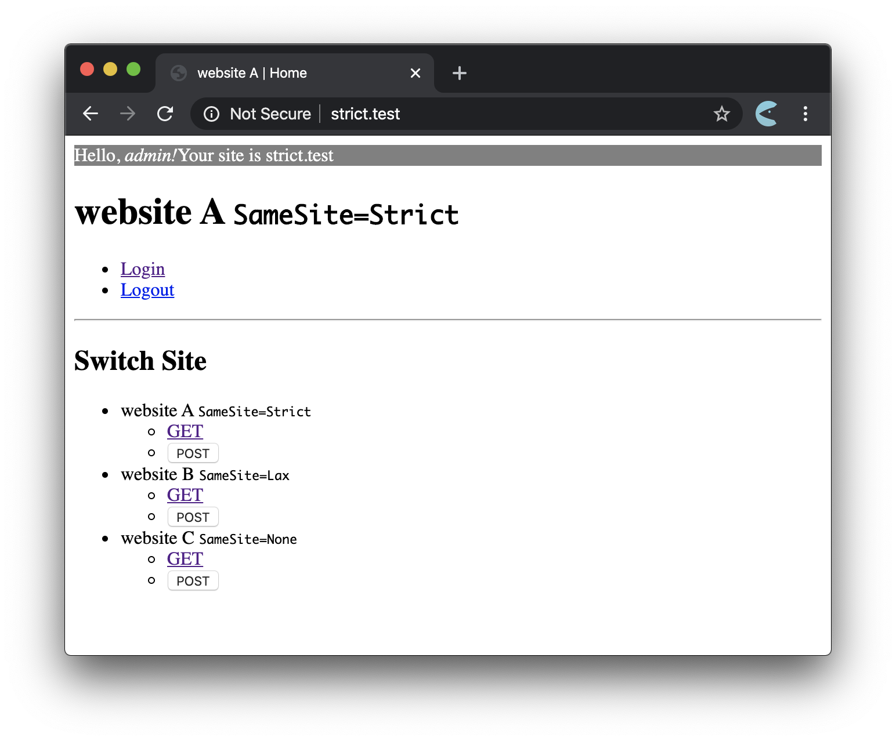

# @kamataryo/sandbox-same-site-cookies

This is an instant server to try `SameSite=Strict|Lax|None` cookies.

** CAUTION **
This program requires privilege to run.
Be aware what you are doing and execute with on your lisk.

## usage

You can try with:

```shell
$ sudo npx @kamataryo/sandbox-same-site-cookies
# or
$ git clone git@github.com:kamataryo/sandbox-same-site-cookies.git
$ cd sandbox-same-site-cookies
$ sudo npm start
```

Then open [http://strict.test](http://strict.test).



## Q&A

- Q: Why is `sudo` required?
- A: This command edit the `/etc/hosts` to use multiple local domains. See [bin.sh](./bin.sh) for details.

- Q: How can I try `SameSite`?
- A:
  1. login at http://strict.test/login first
  2. Move to http://stirict.test with `GET` and you will see a login header
  3. Move to http://none.test with `GET`
  4. Move to http://strict.test with `GET` again and you will miss the login header, i.e. the cookie is not used
  5. login at http://lax.test/login next
  6. Move to http://lax.test with `GET` and you will see the login header
  7. Move to http://none.test with `GET`
  8. Move to http://lax.test with `GET` again and you will see the login header again, i.e. the cookie is used
  9. However, if you use `POST` to move, you will miss the login header, i.e. the cookie is not used
